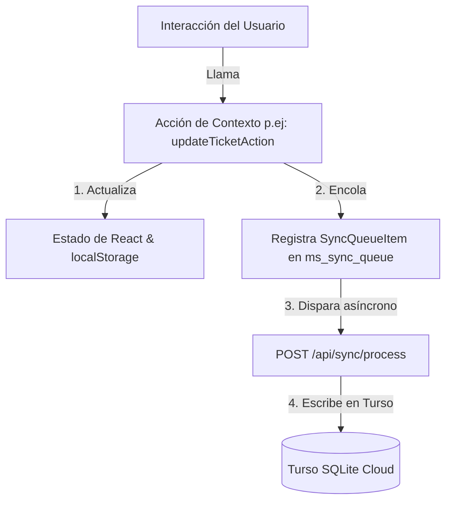

# Arquitectura de Sincronización Orientada a Acciones (Action-Driven Sync)

Este documento detalla la arquitectura de sincronización de datos implementada para garantizar que la base de datos Turso actúe como la única fuente de verdad, resolviendo conflictos en tiempo real entre múltiples dispositivos y previniendo inconsistencias de estado local en la interfaz de usuario.

---

## 1. Carga del Estado Inicial (Hydration)

1. **Hydration Local (Carga Instantánea)**:
   - Al abrir la aplicación, el contexto `ManagementProvider` lee síncronamente el estado guardado de la clave `ms_data` en `localStorage`.
   - Esto permite que la interfaz de usuario se renderice instantáneamente con datos históricos, eliminando tiempos de carga (zero-latency start).

2. **Pull Remoto (Sincronización en Vivo)**:
   - Inmediatamente después de cargar, la aplicación ejecuta `syncFromDatabase()`.
   - Se realiza una consulta HTTP GET hacia `/api/backup?since=TIMESTAMP`.
     - Si es la primera carga, se descarga un snapshot completo de Turso.
     - En cargas subsiguientes, se realiza un pull incremental (solo registros con `updatedAt > timestamp_ultimo_sync`).
   - Los datos remotos se fusionan con el estado local usando la lógica `mergeData()`.

---

## 2. Flujo de Escritura y Sincronización (Action-Driven)

En lugar de depender de efectos automáticos (`useEffect`) de observación y difffing, las mutaciones se canalizan a través de **acciones explícitas** en el contexto:

### Acciones del Contexto Disponibles:
- `addRentalAction(rental, machineUpdates)`: Crea un contrato de alquiler y actualiza los punteros de las máquinas asociadas.
- `updateTicketAction(ticket, machineUpdate)`: Crea o actualiza un ticket técnico y actualiza el estado de la máquina si es provisto.
- `addReadingAction(reading, machineUpdate)`: Registra la lectura mensual de un equipo y actualiza su contador acumulado.
- `updateClientAction(client, op)`: Altas, bajas y modificaciones de clientes.
- `updateMachineAction(machine, op)`: Modificación de equipos en stock o taller.
- `updateAbonoAction(abono, op)`: Configuración de planes y límites de copias.
- `addBudgetAction(budget, op)`: Emisión y edición de presupuestos comerciales.

---

## 3. Resolución de Conflictos

1. **Incremental Server-Wins**:
   - Durante un pull incremental de sincronización (`isIncremental = true`), la versión del **servidor siempre gana** sobre el estado local. Como el servidor solo devuelve registros modificados recientemente por otros usuarios, se garantiza que las escrituras remotas confirmadas se apliquen de inmediato.

2. **Full-Sync Last-Write-Wins (LWW)**:
   - Durante la carga inicial completa (`isIncremental = false`), se comparan los campos `updatedAt` de las entidades locales y del servidor. El registro con la marca de tiempo más reciente sobreescribe al más antiguo.

3. **Time-Drift autoritativo (Server Time)**:
   - Para evitar inconsistencias causadas por desfases en los relojes de los dispositivos de los clientes (celulares, PCs), el endpoint `/api/sync/process` de la base de datos sobreescribe el campo `updatedAt` con `new Date()` (hora del servidor) en cada escritura exitosa.

---

## 4. Agregar Nuevos Módulos en el Futuro

Para expandir la aplicación con nuevas entidades (ej: `proveedores`, `repuestos`):

1. **Esquema de Base de Datos**:
   - Agregar la tabla correspondiente en `src/infrastructure/db/schema/` asegurándose de incluir la columna `updatedAt` con valor por defecto de timestamp.
2. **Esquema de Validaciones**:
   - Registrar los esquemas Zod de inserción y actualización en `src/lib/validation/syncSchemas.ts`.
3. **Acciones del Contexto**:
   - Agregar el estado `useState` en `context.tsx`.
   - Definir una nueva acción en `context.tsx` (ej: `updateRepuestoAction`) que actualice el estado local, guarde en `localStorage` y llame a `enqueueSyncItem('repuestos', 'create'|'update', repuesto)`.
4. **Mapeo de Rutas de Sync**:
   - Registrar la nueva tabla en el objeto `TABLE_MAP` de `/api/sync/process/route.ts` y `/api/backup/route.ts` para que se incluya en el ciclo automático de sincronización incremental y restauración de backups.
